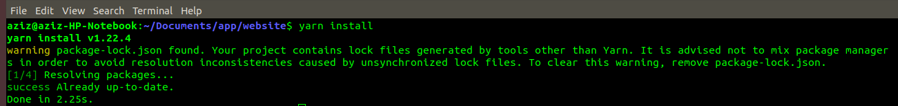
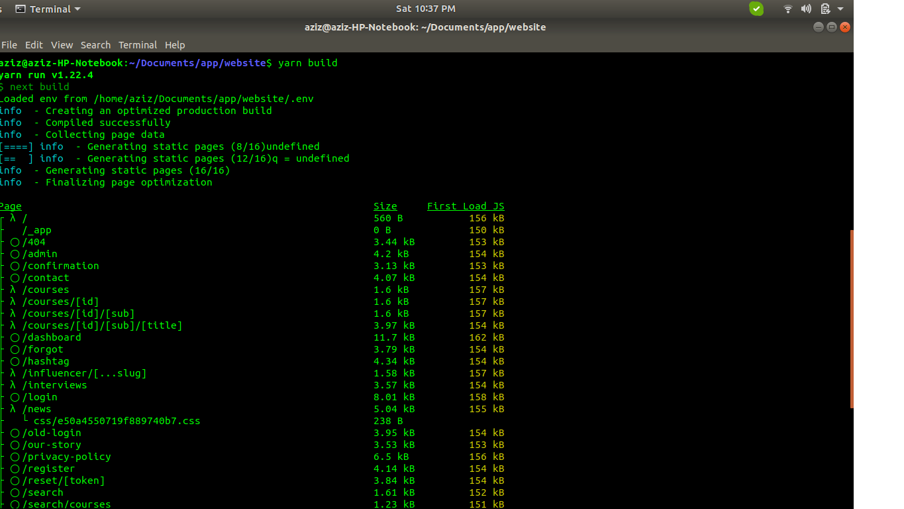
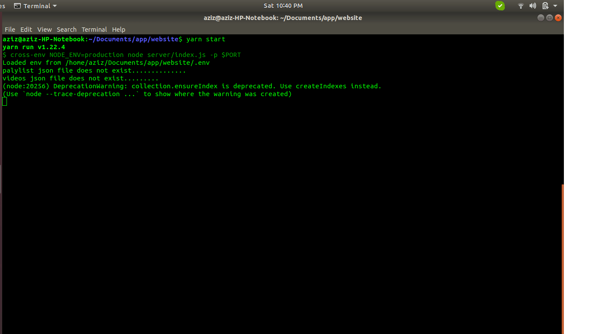

# Important steps for developers!

## How Developers start this application follow this steps!

first you need to clone the latest code from the github repository https://github.com/themoticom/website.git  and then you have website folder in your local machine open the terminal and type this command `cd website`

## Installing Dependencies using this command!
yarn install || npm install 

## Put the .env file in the app root directory its very important!

## Build the application using this command!
yarn build || npm run build

## Start the application using this command!
yarn start || npm run start

## Now your app is running on http://localhost:3000/

## 7 Best Rules for Good Coding Style!

### Readability!
Good code is written to be easily understood by colleagues.
It is properly and consistently formatted and uses clear, meaningful names for
functions and variables. Concise and accurate comments describe a natural
decomposition of the software’s functionality into simple and specific
functions. Any tricky sections are clearly noted. It should be easy to see why
the program will work and reason that it should work in all conceivable cases.

### Maintainability!
Code should be written so that it is straightforward for
another programmer to fix bugs or make changes to its functionality later.
Function should be general and assume as little as possible about preconditions.
All important values should be marked as constants which can be easily changed.
Code should be robust to handle any possible input and produce a reasonable
result without crashing. Clear messages should be output for input which is not
allowed.

### Comments!

**Note: Must write every single line comment for debugging and reading your code !**
Comments are the first step towards making computer program
human readable. Comments should explain clearly everything about a program
which is not obvious to a peer programmer. The volume of comments written is
meaningless, quality is all that counts.
Block comments are written using /* comments */ style. They should go at the top of every source
file and generally include your name, the date your code was written and
overall description of the purpose of that program. Block comments should also
precede most functions with a description of the function’s purpose; these can
be omitted for very short, obvious functions only.
Inline comments are written as //comments, they should go near important lines of code within
functions or with variables when they are initialized.

### Naming!
Names given to classes, variables, and functions should be
unambiguous and descriptive. Other guidelines for naming are:
Capitalization is used to separate multi-word names:
StoneMasonKarel.
The first letter of a class name is always capitalized:
GraphicsProgram
The first letter of a function or variable name is always in
lowercase: setFilled().
The names x and y should only be used to describe
coordinates.
The names i, j, and k should only be used as variables in
for loops.
Other one-letter names should be avoided: area = base *
height instead of a = b * h.
Names of constants are capitalized, with underscores to
separate words: BRICK_COLOR.
Use abbreviations with caution. max instead of maximum is
fine, but xprd instead of crossProduct is a problem.

### Indentation!
Indentation is used to clearly mark control flow in a
program. Within any bracketed block, all code is indented in one tab. This
includes the class body itself. Each additional for, while, if, or switch
structure introduces a new block which is indented, even if brackets are
omitted for one line statements. For if statements, any corresponding else
statements should line up

### White Space!
White space is meaningless to compilers, but should be used
consistently to improve readability. Typically three blank lines are left in
between functions. Individual blank lines are used within functions to separate
key sections. Use of spaces varies as well, but inserting one space usually
make expression more readable; next = 7 *
(prev – 1) is clear than next=7*(prev-1).

### Function Usage!
Function should be short and accomplish a clear, specific
task. As much as possible they should be considered “black boxes” which do not
depend on anything except their parameters and can be handle any possible input
gracefully. A common rule of thumb is the “Ten Line Rule”, usually function
longer than ten lines are trying to do too much and should be simplified.
Another important aspect of functions is that any repeated
segments of code should be made into a separate function. This will shorten
your program and improve readability.

# Precautions Everyone should be followed!
#### Without Comenting don't write code 
#### Don't load big size images for better website speed 
#### Dont write too much code in a single file you can devide the code into the components 
#### Don't push the code on github without Testing

